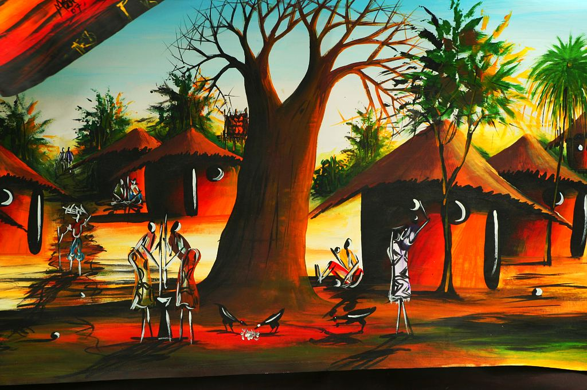
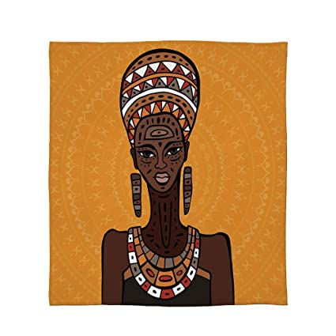
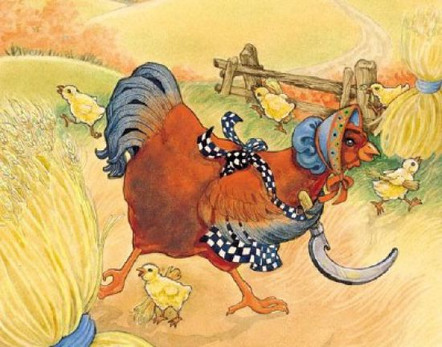
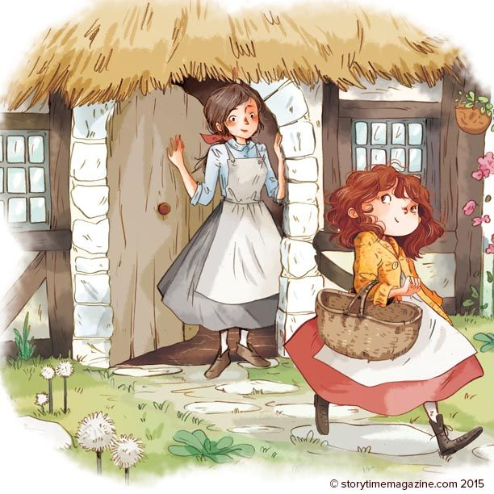
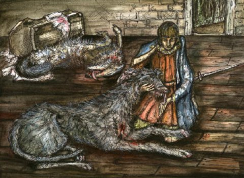

WELCOME TO AFRICAN STORIES BLOQ
This is a site for moonlight tale, where you can relax and enjoy, spend your time.
<html lang="en-gb" dir="ltr">
<title>AFRICAN MOONLIGHT NIGHT-TALE ENTERTAINMENT</title>

<meta charset="UTF-8">
<meta name="viewport" content="width=device-width, initial-scale=1">
<link rel="stylesheet" href="https://www.w3schools.com/w3css/4/w3.css">
<header background-color="blue">

<body>

<!-- Slideshow container -->

  

  

  

  

  

  
 

 

   
   
   

<!-- Navbar (sit on top) -->

  

 

  
    <a href="#home"  class="w3-bar-item w3-button"> <h1>AFRICAN MOONLIGHT NIGHT-TALE ENTERTAINMENT</h1></a>
	
    <!-- Float links to the right. Hide them on small screens -->
    

      <a href="#projects" class="w3-bar-item w3-button">SURPORT US</a>
      <a href="#about" class="w3-bar-item w3-button">About</a>
      <a href="#contact" class="w3-bar-item w3-button">Contact</a>
    

  

<section>
  <nav>
    <ul>
      <li><a href="PRAYER POINTS.html">PRAYER POINTS</a></li>
      <li><a href="https://www.thevillagegist.com/">NEWS</a></li>
      <li><a href="#">GIST</a></li>
    </ul>
  </nav>
  <article>
 

<!-- Header -->
<header class="w3-display-container w3-content w3-wide" style="max-width:1500px;" id="home">

  

    <h1 class="w3-xxlarge w3-text-white"> <u>STORIES</u></h1>
  

</header>

<!-- Page content -->

  <!-- Project Section -->
  

    <h3 class="w3-border-bottom w3-border-light-grey w3-padding-16">READ AND ENJOY YOUR DAY</h3>
  

  <!-- About Section -->
  

    <h3 class="w3-border-bottom w3-border-light-grey w3-padding-16">About</h3>
    
<b>in today's world a lot of people are facing severe problem of depressions and metal complication due to the problem we faced in our daily life, the world is becoming more
       	stressful and difficult place to live, thanks to social media via the help of internet which now keep so many people active and busy, people now finding
		solace on social medial, in this page we tried as much as possible to put together old AFRICAN night-tale stories that used to bring families and friends together in those days before the advent of Internet
		we put together knowledge and entertainment to enable readers have a good time while visiting our pages, we have here a lots of African  Fable stories to help you spend your time most especially while on a journey
        . we hope you find joy and satisfaction while having your time on these pages.
Read the best collection of free bedtime stories, short stories for kids, fairy tales, online story books with kids art, audio stories, funny stories, poems. Read a bedtime story with a child tonight! 
Enjoy our collection of 5 minutes bedtime stories for kids and adults alike below:  </b>	
	
    

  

  

    

      
	    <h3><a href="THE LION AND THE RAT.html"><b>THE LION AND THE RAT</b></a></h3>
      
      
<a href="THE LION AND THE RAT.html"><button class="w3-button w3-light-grey w3-block">VISIT SITE</button></a>

    

    

      
      
<a href="THE TORTOISE AND APIANPIAN.html"><b>THE TORTOISE AND APIANPIAN</b></a>

      
<a href="THE TORTOISE AND APIANPIAN.html"><button class="w3-button w3-light-grey w3-block"><a href="THE TORTOISE AND APIANPIAN.html">VISIT SITE</a></button></a>

    

    

      
      <h6><a href="THE TORTOISE AND THE MEDICINE MAN.html"><b>THE TORTOISE AND THE MEDICINE MAN</b></a></h6>
      
<a href="THE TORTOISE AND THE MEDICINE MAN.html"><button class="w3-button w3-light-grey w3-block">VISIT SITE</button></a>

    

    

       

      <h6><a href="TATABIATA AND THE UNKNOW.html">TATABIATA AND THE UNKNOWN MAN</a></h6>
      
<a href="TATABIATA AND THE UNKNOW.html"><button class="w3-button w3-light-blue w3-block">VISIT SITE</button></a>

    

 
  

      
      <h6><a href="THE WICKED QUEEN.html">THE WICKED QUEEN</a></h6>
      
<a href="THE WICKED QUEEN.html"><button class="w3-button w3-light-blue w3-block">VISIT SITE</button></a>

 
    

 
  
  
  

  

       

      <h6><a href="the sleeping princess.html">THE SLEEPING QUEEN</a></h6>
      
<a href="the sleeping princess.html"><button class="w3-button w3-light-blue w3-block"><a href="the sleeping princess.html">VISIT SITE</a></button></a>

    

    
     

      
      <h6><a href="THE UNKNOW STRANGER.html">THE UNKNOW STRANGER</a></h6>
     
<a href="THE UNKNOW STRANGER.html"><button class="w3-button w3-light-blue w3-block">VISIT SITE</button></a>

    

  

	 

      
      <h6><a href="FUNNY FOWL.html">THE FUNNY FOWL</a></h6>
     
<a href="FUNNY FOWL.html"><button class="w3-button w3-light-blue w3-block">VISIT SITE</button></a>

    

 
	
	
	 

	 

      
      <h6><a href="MAGIC POT.html">THE MAGIC POT</a></h6>
     
<a href="MAGIC POT.html"><button class="w3-button w3-light-blue w3-block">VISIT SITE</button></a>

    

  

	

      
      <h6><a href="𝗪𝗵𝘆 𝗶𝘀 𝘁𝗵𝗲 𝗱𝗼𝗴 𝗮 𝗯𝗲𝘀𝘁 𝗳𝗿𝗶𝗲𝗻𝗱 𝘁𝗼 𝗺𝗮𝗻.html">MAN AND THE DOG</a></h6>
      
<a href="𝗪𝗵𝘆 𝗶𝘀 𝘁𝗵𝗲 𝗱𝗼𝗴 𝗮 𝗯𝗲𝘀𝘁 𝗳𝗿𝗶𝗲𝗻𝗱 𝘁𝗼 𝗺𝗮𝗻.html"><button class="w3-button w3-light-blue w3-block">VISIT SITE</button></a>

 
    

    

    
   

      
      <h6><a href="THE CAT IN THE KITCHEN.html">THE CAT IN THE KITCHEN</a></h6>
      
<a href="THE CAT IN THE KITCHEN.html"><button class="w3-button w3-light-blue w3-block">VISIT SITE</button></a>

 
    

    

    
    

      
      <h6><a href="THE CUNNY TORTOISE.html">THE CUNNY TORTOISE</a></h6>
      
<a href="THE CUNNY TORTOISE.html"><button class="w3-button w3-light-blue w3-block">VISIT SITE</button></a>

 
    

    

    

      
      <h6><a href="THE FROG AND HIS WIVES.html"> THE FROG AND HIS WIVES</a></h6>
      
<a href=" THE FROG AND HIS WIVES.html"><button class="w3-button w3-light-blue w3-block">VISIT SITE</button></a>

 
    

    
    

      <h6><a href="THE TWO STRANGERS.html"> THE TWO STRANGERS</a></h6>
      
<a href="THE TWO STRANGERS.html"><button class="w3-button w3-light-blue w3-block">VISIT SITE</button></a>

 
    

 

      
      <h6><a href="THE MAGIC CROCODILE.html"> THE MAGIC CROCODILE</a></h6>
      
<a href="THE MAGIC CROCODILE.html"><button class="w3-button w3-light-blue w3-block">VISIT SITE</button></a>

 
    

   

	
	

      
      <h6><a href="THE UNLOVING BOY.html">THE UNLOVING BOY</a></h6>
      
<a href="THE UNLOVING BOY.html"><button class="w3-button w3-light-blue w3-block">VISIT SITE</button></a>

 
    

   

   
   

	

      
      <h6><a href=" CAT AND THE MOUSE.html"> CAT AND THE MOUSE</a></h6>
      
<a href=" CAT AND THE MOUSE.html"><button class="w3-button w3-light-blue w3-block">VISIT SITE</button></a>

 
    

   

 
  

	

      
      <h6><a href=" THE TORTOISE AND THE KING.html"> THE TORTOISE AND THE KING</a></h6>
      
<a href=" THE TORTOISE AND THE KING.html"><button class="w3-button w3-light-blue w3-block">VISIT SITE</button></a>

 
    

   

  

	

      
      <h6><a href="THE MAGIC PYTHON.html">THE MAGIC PYTHON</a></h6>
      
<a href=" THE MAGIC PYTHON.html"><button class="w3-button w3-light-blue w3-block">VISIT SITE</button></a>

 
    

   

 
   

	

      
      <h6><a href="THE ELEPHANT.html">THE ELEPHANT</a></h6>
      
<a href="THE ELEPHANT.html"><button class="w3-button w3-light-blue w3-block">VISIT SITE</button></a>

 
    

   

    

	

      
      <h6><a href="THE CRUEL WOLF.html">  THE CRUEL WOLF</a></h6>
      
<a href="THE CRUEL WOLF.html"><button class="w3-button w3-light-blue w3-block">VISIT SITE</button></a>

 
    

   

  
  

	

      
      <h6><a href="THE CLEVER LIZARD.html">THE CLEVER LIZARD</a></h6>
      
<a href="THE CLEVER LIZARD.html"><button class="w3-button w3-light-blue w3-block">VISIT SITE</button></a>

 
    

   

   
   

	

      
      <h6><a href="THE LOVE OF A MOTHER.html">THE LOVE OF A MOTHER</a></h6>
      
<a href="THE LOVE OF A MOTHER.html"><button class="w3-button w3-light-blue w3-block">VISIT SITE</button></a>

 
    

   

  
    

	

      
      <h6><a href=" THE REJECTED TWINS.html"> THE REJECTED TWINS</a></h6>
      
<a href=" THE REJECTED TWINS.html"><button class="w3-button w3-light-blue w3-block">VISIT SITE</button></a>

 
    

   

 
   

	

      
      <h6><a href="THE WISE GOAT.html">THE WISE GOAT</a></h6>
      
<a href="THE WISE GOAT.html"><button class="w3-button w3-light-blue w3-block">VISIT SITE</button></a>

 
    

   

   

	

      
      <h6><a href="The Wise Dog.html">The Wise Dog</a></h6>
      
<a href="The Wise Dog.html"><button class="w3-button w3-light-blue w3-block">VISIT SITE</button></a>

 
    

   

   

	

      
      <h6><a href=" THE LION AND THE JACKAL.html"> THE LION AND THE JACKAL</a></h6>
      
<a href=" THE LION AND THE JACKAL.html"><button class="w3-button w3-light-blue w3-block">VISIT SITE</button></a>

 
    

   

  
    

	

      
      <h6><a href=" WISIEST TORTOISE.html"> WISIEST TORTOISE</a></h6>
      
<a href=" WISIEST TORTOISE.html"><button class="w3-button w3-light-blue w3-block">VISIT SITE</button></a>

 
    

   

  
    

	

      
      <h6><a href=" THE UNWISE LION.html"> THE UNWISE LION</a></h6>
      
<a href="THE UNWISE LION.html"><button class="w3-button w3-light-blue w3-block">VISIT SITE</button></a>

 
    

   

	  

	

      
      <h6><a href=" THE WISE MONKEY.html"> THE WISE MONKEY</a></h6>
      
<a href="THE WISE MONKEY.html"><button class="w3-button w3-light-blue w3-block">VISIT SITE</button></a>

 
    

   

	   
	  

	

      
      <h6><a href="FRIENDSHIP WITH THE ENEMY.html">FRIENDSHIP WITH THE ENEMY</a></h6>
      
<a href="FRIENDSHIP WITH THE ENEMY.html"><button class="w3-button w3-light-blue w3-block">VISIT SITE</button></a>

 
    

      

	  

	

      
      <h6><a href="THE STRAWN LITTLE CHICKEN.html">THE STRAWN LITTLE CHICKEN</a></h6>
      
<a href="THE STRAWN LITTLE CHICKEN.html"><button class="w3-button w3-light-blue w3-block">VISIT SITE</button></a>

 
    

   

    

   

      
      <h6><a href="Biography.html">PASTOR FELIX ITAMAN UWAMUSI</a></h6>
      
<button class="w3-button w3-light-blue w3-block">VISIT SITE</button>

    

  

 
  
 

  <!-- Contact Section -->
  

    <h3 class="w3-border-bottom w3-border-light-grey w3-padding-16">Contact</h3>
    
Lets get in touch and talk about your next project.

    <form action="/action_page.php" target="_blank">
      <input class="w3-input w3-border" type="text" placeholder="Name" required name="Name">
      <input class="w3-input w3-section w3-border" type="text" placeholder="Email" required name="Email">
      <input class="w3-input w3-section w3-border" type="text" placeholder="Subject" required name="Subject">
      <input class="w3-input w3-section w3-border" type="text" placeholder="Comment" required name="Comment">
      <button class="w3-button w3-black w3-section" type="submit">
        <i class="fa fa-paper-plane"></i> SEND MESSAGE
      </button>
    </form>
  

  
<!-- Image of location/map -->

  

<!-- End page content -->

<!-- Footer -->
<footer class="w3-center w3-black w3-padding-16">
  
Powered by <a href="https://www.w3schools.com/w3css/default.asp" title="W3.CSS" target="_blank" class="w3-hover-text-green">w3.css</a>

</footer>
 <!-- Load Facebook SDK for JavaScript -->
  

  

  <!-- Your share button code -->
  

  

<a href="https://twitter.com/intent/tweet?screen_name=TwitterDev&ref_src=twsrc%5Etfw" class="twitter-mention-button" data-show-count="false">
Tweet to @TwitterDev</a>
<a href="https://twitter.com/TwitterDev?ref_src=twsrc%5Etfw" class="twitter-follow-button" data-show-count="false">
Follow @TwitterDev</a>
<a href="https://twitter.com/share?ref_src=twsrc%5Etfw" class="twitter-share-button" data-show-count="false">Tweet
</a>

